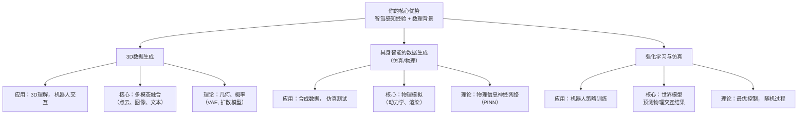

# 问
作为一名智驾感知算法工程师，在2026已经充分感受到，越来越多同事在转向具身智能，语言大模型，3d数据生成等自动驾驶以外的领域。如果我对于这些领域的数据生成比较感兴趣，请问应该从哪些方面准备面试，熟悉哪些应用框架？我对于数学物理理论比较爱好，想知道，哪些方向更适合我？
# 答
针对你从智驾感知转向“具身智能与数据生成”领域的兴趣，结合你的数理背景，**“3D数据生成”和“具身智能中的仿真与物理建模”是最能发挥你优势的两个方向**。

为了让你更直观地看到各个方向如何与你的技能结合，下图梳理了核心方向与你的数理背景、感知经验的匹配点：

### 🧭 为什么这些方向适合你？
这两个方向与你的背景深度契合，能形成独特的竞争优势：
*   **3D数据生成**：这是你感知工作的“上游”。自动驾驶积累的3D感知（如点云处理、目标检测）是3D数据生成的基础。你擅长的**线性代数、几何和概率论**（如理解VAE、扩散模型的潜空间）是理解生成模型的关键。这个领域正致力于通过自动化生成高质量3D数据，以降低标注成本、填补数据长尾。
*   **具身智能的仿真与物理建模**：这是机器人学的核心。你的数理背景，尤其是**动力学、最优控制和对物理世界的直觉**，在构建高保真仿真环境、设计物理启发模型或利用**物理信息神经网络**（PINN）方面极具优势。搜索结果显示，行业正积极将神经重建与物理仿真结合，为具身智能体创造训练场。

### 📚 面试准备：知识与框架
你需要围绕上述方向，构建一个“理论+实践+行业应用”的知识体系。

**1. 必备知识框架**
*   **生成模型原理**：深入理解**扩散模型** (如何逐步去噪生成数据)、**VAE** (如何编码和解码) 和**GAN** 的基本原理与区别。这是理解当前AIGC浪潮的基石。
*   **3D表示与学习**：掌握点云、神经辐射场、高斯溅射等3D数据表示方法。关注如何融合视觉、语言等多模态信息进行3D理解与生成。
*   **物理仿真基础**：了解刚体/柔体动力学、运动学、碰撞检测等基本概念。
*   **领域前沿**：关注顶级会议（CVPR, ICRA, NeurIPS, CoRL）的最新论文。例如，PiSA项目展示了如何通过2D/3D多模态大模型协同生成高质量3D标注数据；NVIDIA的研究展示了如何用神经重建技术构建自动驾驶仿真环境。

**2. 熟悉常用应用框架**
*   **3D数据生成与处理**：
    *   **PyTorch3D / Open3D**：主流的3D深度学习库和数据处理工具。
    *   **Blender / Omniverse**：强大的3D建模、渲染和仿真平台，后者常用于生成合成数据。
*   **具身智能仿真**：
    *   **Isaac Sim**：基于NVIDIA Omniverse，是机器人仿真的行业标杆，物理精度高。
    *   **MuJoCo / PyBullet**：流行的物理仿真器，常用于强化学习研究。
*   **基础工具链**：熟练使用 **PyTorch**，了解 **ROS/ROS2** 机器人操作系统。

### 💡 如何最大化你的背景优势
在学习和准备过程中，有意识地建立连接：
*   **在项目中融合背景**：例如，思考“如何用扩散模型生成符合物理规律的驾驶场景数据？”或“如何将车辆动力学约束引入具身智能体的动作生成中？”
*   **在面试中讲述故事**：不要只说你“学过”什么，而是清晰地阐述你过去的**感知工作**（如处理传感器噪声、多目标跟踪）如何让你深刻理解**数据质量和物理规律对模型的关键影响**，从而驱动你对下一代生成式与具身智能技术的探索。

### 💎 总结与建议
你的转型不是从零开始，而是**一次有策略的技术延伸与升级**。两条主要路径是：
1.  **向“上游”走，专注于3D数据生成**：成为解决机器人、自动驾驶等领域数据瓶颈的专家。
2.  **向“底层”走，专注于仿真与物理建模**：成为构建高逼真、可编程物理世界，以训练具身智能体的专家。

你的数理背景是应对这两个领域核心挑战（如生成模型的数学原理、物理系统的建模与优化）的宝贵财富。**下一步，建议你选择其中一个方向，找到一个开源项目（例如PiSA或NVIDIA的仿真工作流）进行复现或深入探索，这是将理论知识转化为实践能力、充实简历和面试话题的最快方式。**
